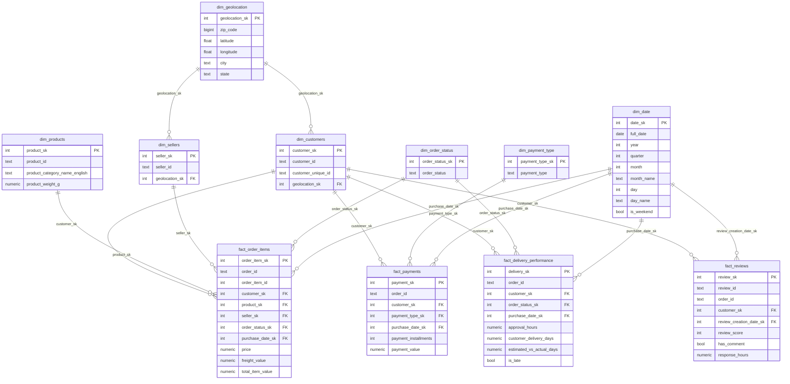

# Olist E-Commerce Data Warehouse — Project Documentation

## Table of Contents
1. [Project Overview](#1-project-overview)
2. [Architecture Design](#2-architecture-design)
3. [Data Model](#3-data-model)
4. [ETL Pipeline Design](#4-etl-pipeline-design)
5. [Performance Optimization](#5-performance-optimization)
6. [Reporting Layer — Analytical Queries](#6-reporting-layer--analytical-queries)
7. [Key Assumptions](#7-key-assumptions)
8. [Trade-offs & Design Decisions](#8-trade-offs--design-decisions)
9. [How to Run](#9-how-to-run)

---

## 1. Project Overview

**Dataset:** Olist Brazilian E-Commerce (SQLite format)  
**Source:** https://www.kaggle.com/datasets/terencicp/e-commerce-dataset-by-olist-as-an-sqlite-database  
**Target:** PostgreSQL Data Warehouse  
**Tools:** Python 3, pandas, SQLAlchemy, psycopg2, PostgreSQL

The Olist dataset represents a Brazilian e-commerce marketplace. It contains data about orders, customers, sellers, products, payments, reviews, and seller acquisition (leads). The goal is to transform this operational data into a queryable analytical data warehouse.

---

## 2. Architecture Design

### 2.1 Chosen Architecture: Kimball Galaxy Schema (Fact Constellation)

**Why Galaxy Schema?**

The Olist business produces **five distinct business processes**, each with a different grain and measure set. A pure Star Schema (one central fact table) cannot adequately represent all of them without either blending incompatible grains or creating complex bridges. The **Galaxy Schema** — multiple fact tables sharing conformed dimension tables — is the natural fit.

| Reason | Explanation |
|--------|-------------|
| **Multiple business processes** | 5 independent fact tables: sales, payments, delivery, reviews, seller leads — each with its own grain |
| **Conformed dimensions** | `dim_date`, `dim_customers`, `dim_sellers` are shared across all relevant facts — the hallmark of a Galaxy Schema |
| **Query performance** | Fewer JOINs than a normalised (3NF) schema; each fact is queried independently |
| **Reporting focus** | Different analytical questions target different facts — Galaxy Schema maps naturally to this |
| **Dataset size** | Medium-sized dataset; Inmon's full 3NF normalisation overhead is not justified |

**Galaxy Schema vs Star Schema:** A Star Schema has one central fact table. A Galaxy Schema (also called Fact Constellation) is a collection of Star Schemas that share conformed dimensions. This project is a Galaxy Schema because `dim_date`, `dim_customers`, and `dim_geolocation` are referenced by multiple fact tables simultaneously.

**Why NOT Inmon?** Inmon requires a fully normalised 3NF corporate data store before building data marts. This adds significant engineering overhead without analytical benefit for this dataset.

**Why NOT pure Medallion (Delta Lake)?** Medallion architecture (Bronze/Silver/Gold) is optimised for streaming and big data platforms (Databricks, Spark). Our dataset is batch-oriented and fits in a relational database.

### 2.2 Schema Layout

```
PostgreSQL Database: olist_dwh
│
├── staging.*       ← Raw copies of all SQLite source tables
│
└── dwh.*           ← Dimensional model (Galaxy Schema / Fact Constellation)
    ├── Dimensions  (10 tables)
    └── Facts       (5 tables)
```

### 2.3 Architecture Diagram

```
┌─────────────────────┐      ┌──────────────────────┐      ┌──────────────────────────┐
│   SOURCE SYSTEM     │      │    ETL PIPELINE       │      │   TARGET: DWH SCHEMA     │
│                     │      │                       │      │                          │
│  olist.sqlite       │─────▶│  1. Extract           │      │  dim_date                │
│  ─────────────      │      │     (extract.py)      │      │  dim_geolocation         │
│  orders             │      │         │             │      │  dim_customers           │
│  customers          │      │         ▼             │      │  dim_sellers             │
│  sellers            │      │  staging.*            │      │  dim_products            │
│  products           │      │  (raw PostgreSQL)     │      │  dim_order_status        │
│  order_items        │      │         │             │      │  dim_payment_type        │
│  order_payments     │      │  2. Transform         │      │  dim_lead_origin         │
│  order_reviews      │      │     (transform.py)    │      │  dim_lead_profile        │
│  geolocation        │      │         │             │      │  dim_business_segment    │
│  leads_qualified    │      │  3. Load              │      │                          │
│  leads_closed       │      │     (load.py)         │      │  fact_order_items        │
│  product_cat...     │      │                       │─────▶│  fact_payments           │
└─────────────────────┘      └──────────────────────┘      │  fact_delivery_perf.     │
                                                            │  fact_reviews            │
                                                            │  fact_seller_leads       │
                                                            └──────────────────────────┘
```

---

## 3. Data Model

### 3.1 Business Processes Identified

Five distinct business processes were identified in the Olist dataset, each represented as a fact table:

| Business Process | Fact Table | Grain |
|-----------------|------------|-------|
| Order line items (sales) | `fact_order_items` | One row per order item |
| Payment transactions | `fact_payments` | One row per payment installment per order |
| Delivery & logistics | `fact_delivery_performance` | One row per order |
| Customer reviews | `fact_reviews` | One row per review |
| Seller lead acquisition | `fact_seller_leads` | One row per marketing qualified lead (MQL) |

### 3.2 Dimension Tables

| Dimension | Natural Key | Description |
|-----------|-------------|-------------|
| `dim_date` | `date_sk` (YYYYMMDD) | Calendar attributes: year, quarter, month, day, weekend flag |
| `dim_geolocation` | `zip_code` | Aggregated lat/lng per zip code, city, state |
| `dim_customers` | `customer_id` | Customer + their location (via geolocation_sk) |
| `dim_sellers` | `seller_id` | Seller + their location (via geolocation_sk) |
| `dim_products` | `product_id` | Product attributes + English category name |
| `dim_order_status` | `order_status` | Status codes: delivered, shipped, canceled, etc. |
| `dim_payment_type` | `payment_type` | Credit card, boleto, voucher, debit card |
| `dim_lead_origin` | `(origin, landing_page_id)` | How the lead was acquired |
| `dim_lead_profile` | Composite | Lead characteristics: type, behaviour, business type |
| `dim_business_segment` | `business_segment` | Industry segment of the seller lead |

### 3.3 Fact Tables — Detail

#### `fact_order_items`
- **Grain:** One row per item within an order
- **Measures:** `price`, `freight_value`, `total_item_value`
- **Foreign Keys:** customer, product, seller, order_status, purchase_date

#### `fact_payments`
- **Grain:** One row per payment installment per order
- **Measures:** `payment_value`, `payment_installments`
- **Foreign Keys:** customer, payment_type, purchase_date
- **Note:** An order can have multiple payment methods (e.g., credit card + voucher)

#### `fact_delivery_performance`
- **Grain:** One row per order (order-level delivery tracking)
- **Measures:** `approval_hours`, `carrier_delivery_days`, `customer_delivery_days`, `estimated_vs_actual_days`, `is_late` (boolean)
- **Foreign Keys:** customer, order_status, 5 date dimensions (purchase, approval, carrier, customer delivery, estimated)

#### `fact_reviews`
- **Grain:** One row per review
- **Measures:** `review_score`, `has_comment` (boolean), `response_hours`
- **Foreign Keys:** customer, review creation date, review answer date

#### `fact_seller_leads`
- **Grain:** One row per Marketing Qualified Lead (MQL)
- **Measures:** `declared_monthly_revenue`, `declared_product_catalog_size`, `days_to_close`, `is_closed` (boolean)
- **Foreign Keys:** seller, lead_origin, lead_profile, business_segment, first_contact_date, won_date

### 3.4 Data Model ERD (Mermaid)



---

## 4. ETL Pipeline Design

### 4.1 Pipeline Overview

The pipeline is implemented as a Python script (`etl/pipeline.py`) that orchestrates three phases: **Extract → Transform → Load**.

### 4.2 File Structure

```
week_8/
├── config/
│   ├── source_connection.py   ← SQLite connection
│   └── target_connection.py   ← PostgreSQL connection (SQLAlchemy)
├── etl/
│   ├── extract.py             ← Phase 1: SQLite → PostgreSQL staging
│   ├── transform.py           ← Phase 2: staging → dwh DataFrames
│   ├── load.py                ← Phase 3: DataFrames → dwh tables
│   └── pipeline.py            ← Orchestrator (run this)
├── sql/
│   └── create_dwh_tables.sql  ← DDL for all schemas, tables, indexes
├── source/
│   └── olist.sqlite           ← Source database
└── requirements.txt
```

### 4.3 Pipeline Execution Steps

```
Step 1 ── DDL Execution
          Run create_dwh_tables.sql:
          - CREATE SCHEMA staging, dwh
          - CREATE TABLE all dims and facts (IF NOT EXISTS)
          - CREATE INDEX for performance

Step 2 ── Extract (extract.py)
          - Discover all tables in SQLite via sqlite_master
          - For each table: read in chunks of 50,000 rows
          - Write to staging.{table_name} in PostgreSQL
          - First chunk: REPLACE table; subsequent: APPEND

Step 3 ── Transform & Load: Independent Dims
          dim_date, dim_geolocation, dim_products,
          dim_order_status, dim_payment_type

Step 4 ── Transform & Load: Lead Dims
          dim_lead_origin, dim_lead_profile, dim_business_segment

Step 5 ── Transform & Load: Dependent Dims
          dim_customers (needs dim_geolocation)
          dim_sellers   (needs dim_geolocation)

Step 6 ── Transform & Load: Facts
          fact_order_items, fact_payments,
          fact_delivery_performance, fact_reviews,
          fact_seller_leads
```

> **Load Strategy:** Each table uses **Truncate-and-Reload** (full refresh).  
> `TRUNCATE TABLE dwh.{table} RESTART IDENTITY CASCADE` → then bulk INSERT via pandas `to_sql(method="multi")`.

### 4.4 Failure Handling

| Concern | Handling |
|---------|----------|
| Missing SQLite file | `FileNotFoundError` raised in `source_connection.py` |
| Missing SQL DDL file | `FileNotFoundError` raised in `run_sql_file()` |
| Table not found in DWH | `RuntimeError` raised in `truncate_table()` before any load |
| DB connection errors | SQLAlchemy engine errors propagate naturally; `engine.dispose()` called in `finally` blocks |
| Chunked extraction | Memory-safe: 50,000 rows per chunk; never loads full table into RAM |

### 4.5 Reproducibility

The pipeline is fully idempotent:
- `CREATE SCHEMA IF NOT EXISTS` — safe to re-run
- `CREATE TABLE IF NOT EXISTS` — safe to re-run
- `CREATE INDEX IF NOT EXISTS` — safe to re-run
- `TRUNCATE ... RESTART IDENTITY CASCADE` — resets data and sequences on each run

---

## 5. Performance Optimization

### 5.1 Indexing Strategy

Indexes are created on all foreign key columns used in common JOIN and filter patterns:

```sql
-- fact_order_items
CREATE INDEX IF NOT EXISTS idx_fact_order_items_order_id      ON dwh.fact_order_items(order_id);
CREATE INDEX IF NOT EXISTS idx_fact_order_items_customer_sk   ON dwh.fact_order_items(customer_sk);
CREATE INDEX IF NOT EXISTS idx_fact_order_items_product_sk    ON dwh.fact_order_items(product_sk);

-- fact_payments
CREATE INDEX IF NOT EXISTS idx_fact_payments_order_id         ON dwh.fact_payments(order_id);

-- fact_delivery_performance
CREATE INDEX IF NOT EXISTS idx_fact_delivery_order_id         ON dwh.fact_delivery_performance(order_id);

-- fact_reviews
CREATE INDEX IF NOT EXISTS idx_fact_reviews_order_id          ON dwh.fact_reviews(order_id);

-- fact_seller_leads
CREATE INDEX IF NOT EXISTS idx_fact_seller_leads_mql_id       ON dwh.fact_seller_leads(mql_id);
CREATE INDEX IF NOT EXISTS idx_fact_seller_leads_seller_sk    ON dwh.fact_seller_leads(seller_sk);
```

### 5.2 Surrogate Keys

All dimension tables use `SERIAL` surrogate keys (integer PKs). This reduces JOIN cost compared to joining on long `TEXT` natural keys (e.g., `customer_id` which is a 32-char UUID).

### 5.3 Date Surrogate Key Design

`dim_date` uses an integer surrogate key in `YYYYMMDD` format (e.g., `20181103`). This is computed as:
```sql
TO_CHAR(date_column::DATE, 'YYYYMMDD')::INTEGER
```
**Why?** Integer comparisons are faster than `DATE` comparisons. Date filtering becomes a simple integer range scan.

### 5.4 Chunked Extraction

SQLite data is read in chunks of `50,000` rows to prevent out-of-memory errors on large tables like `geolocation` (~1M rows).

### 5.5 Data Type Casting

All dimensions and facts enforce explicit casting (`::INTEGER`, `::NUMERIC`, `::BOOLEAN`) during the Transform phase to ensure consistent PostgreSQL types rather than relying on pandas inference.

### 5.6 Future Optimization Opportunities

| Technique | Applicable To |
|-----------|---------------|
| Table partitioning by year/month | `fact_order_items`, `fact_delivery_performance` |
| Materialized views | Common aggregation queries (monthly revenue) |
| BRIN indexes | Append-only time-series facts |
| Parallel bulk load | `COPY` command instead of `to_sql` for 10x faster inserts |

---

## 6. Reporting Layer — Analytical Queries

### Q1: How are sales trending over time?
```sql
SELECT
    d.year,
    d.month,
    d.month_name,
    COUNT(DISTINCT f.order_id)   AS total_orders,
    SUM(f.total_item_value)      AS total_revenue,
    AVG(f.total_item_value)      AS avg_order_value
FROM dwh.fact_order_items f
JOIN dwh.dim_date d ON f.purchase_date_sk = d.date_sk
GROUP BY d.year, d.month, d.month_name
ORDER BY d.year, d.month;
```

### Q2: Who are the most valuable customers?
```sql
SELECT
    c.customer_unique_id,
    COUNT(DISTINCT f.order_id)  AS total_orders,
    SUM(f.total_item_value)     AS lifetime_value,
    AVG(f.total_item_value)     AS avg_order_value
FROM dwh.fact_order_items f
JOIN dwh.dim_customers c ON f.customer_sk = c.customer_sk
GROUP BY c.customer_unique_id
ORDER BY lifetime_value DESC
LIMIT 20;
```

### Q3: What affects delivery performance?
```sql
SELECT
    g.state,
    COUNT(*)                             AS total_orders,
    AVG(fp.customer_delivery_days)       AS avg_delivery_days,
    SUM(CASE WHEN fp.is_late THEN 1 ELSE 0 END) AS late_orders,
    ROUND(
        100.0 * SUM(CASE WHEN fp.is_late THEN 1 ELSE 0 END) / COUNT(*), 2
    ) AS late_rate_pct
FROM dwh.fact_delivery_performance fp
JOIN dwh.dim_customers c  ON fp.customer_sk = c.customer_sk
JOIN dwh.dim_geolocation g ON c.geolocation_sk = g.geolocation_sk
WHERE fp.customer_delivery_days IS NOT NULL
GROUP BY g.state
ORDER BY late_rate_pct DESC;
```

### Q4: Which products/categories drive revenue?
```sql
SELECT
    p.product_category_name_english,
    COUNT(*)                      AS items_sold,
    SUM(f.price)                  AS total_revenue,
    SUM(f.freight_value)          AS total_freight,
    AVG(f.price)                  AS avg_price
FROM dwh.fact_order_items f
JOIN dwh.dim_products p ON f.product_sk = p.product_sk
WHERE p.product_category_name_english <> 'unknown'
GROUP BY p.product_category_name_english
ORDER BY total_revenue DESC
LIMIT 15;
```

### Q5: Customer satisfaction by category
```sql
SELECT
    p.product_category_name_english,
    COUNT(r.review_sk)          AS review_count,
    AVG(r.review_score)         AS avg_score,
    SUM(CASE WHEN r.has_comment THEN 1 ELSE 0 END) AS reviews_with_comments
FROM dwh.fact_reviews r
JOIN dwh.fact_order_items f   ON r.order_id = f.order_id
JOIN dwh.dim_products p       ON f.product_sk = p.product_sk
WHERE p.product_category_name_english <> 'unknown'
GROUP BY p.product_category_name_english
ORDER BY avg_score ASC
LIMIT 15;
```

### Q6: Payment method distribution
```sql
SELECT
    pt.payment_type,
    COUNT(*)                   AS payment_count,
    SUM(fp.payment_value)      AS total_value,
    AVG(fp.payment_installments) AS avg_installments
FROM dwh.fact_payments fp
JOIN dwh.dim_payment_type pt ON fp.payment_type_sk = pt.payment_type_sk
GROUP BY pt.payment_type
ORDER BY total_value DESC;
```

### Q7: Seller lead conversion funnel
```sql
SELECT
    lo.origin,
    COUNT(*)                                             AS total_leads,
    SUM(CASE WHEN sl.is_closed THEN 1 ELSE 0 END)        AS converted_leads,
    ROUND(
        100.0 * SUM(CASE WHEN sl.is_closed THEN 1 ELSE 0 END) / COUNT(*), 2
    ) AS conversion_rate_pct,
    AVG(sl.days_to_close) FILTER (WHERE sl.is_closed)    AS avg_days_to_close
FROM dwh.fact_seller_leads sl
JOIN dwh.dim_lead_origin lo ON sl.lead_origin_sk = lo.lead_origin_sk
GROUP BY lo.origin
ORDER BY total_leads DESC;
```

---

## 7. Key Assumptions

| # | Assumption |
|---|-----------|
| 1 | **Geolocation deduplication:** The source `geolocation` table has multiple rows per zip code with slightly different lat/lng values. We aggregate by zip code using `AVG(lat)`, `AVG(lng)`, and `MIN(city)` to produce one row per zip. |
| 2 | **Date dimension scope:** `dim_date` only contains dates that appear in the actual data (not a full calendar). This keeps it lean without sacrificing functionality. |
| 3 | **customer_id vs customer_unique_id:** The source uses `customer_id` as an order-scoped identifier (a customer can have multiple `customer_id` values). `customer_unique_id` is the true customer identity. Both are preserved in `dim_customers`. |
| 4 | **Full refresh pipeline:** Since the source is a static SQLite snapshot (not a live system), full truncate-and-reload is appropriate. No incremental logic is needed. |
| 5 | **Null handling:** Unknown product categories are filled with `'unknown'`. Boolean fields (`has_company`, `has_gtin`) use explicit `NULL` for missing values rather than defaulting to `FALSE`. |
| 6 | **Lead profile as a dimension:** `dim_lead_profile` captures combinations of behavioral attributes. This is a junk dimension pattern — grouping low-cardinality flags together. |
| 7 | **No SCD (Slowly Changing Dimensions):** Since the source is a historical snapshot, there is no need for SCD Type 2. All dimensions are treated as static. |

---

## 8. Trade-offs & Design Decisions

### Decision 1: Galaxy Schema (Fact Constellation) over Star Schema

**Chosen:** Kimball Galaxy Schema  
**Reason:** The dataset contains five fundamentally different business processes (sales, payments, delivery, reviews, seller leads), each with a different grain. A single Star Schema fact table cannot cleanly represent all of them. The Galaxy Schema allows each process to have its own fact table at the correct grain, while sharing conformed dimensions (`dim_date`, `dim_customers`, `dim_geolocation`) across all facts.  
**Trade-off:** Galaxy Schema is slightly more complex to navigate than a single Star Schema, but it avoids fan-out aggregation errors that would occur from mixing grains in one table. This trade-off is justified given the multi-process nature of the Olist dataset.

### Decision 2: Separate fact_payments from fact_order_items

**Chosen:** Two separate fact tables  
**Reason:** Payments and order items have different grains. An order can have multiple payment methods (e.g., credit card + voucher). Mixing them would require a MANY-to-MANY bridge or would cause fan-out errors in aggregations.

### Decision 3: Pre-computed metrics in facts

**Chosen:** Store computed columns (`total_item_value`, `approval_hours`, `is_late`, `days_to_close`) directly in fact tables  
**Trade-off:** Increases storage but eliminates repeated computation in every analytical query. This is standard in dimensional modeling — "measure once, query many."

### Decision 4: dim_geolocation as a shared dimension

**Chosen:** Both `dim_customers` and `dim_sellers` reference `dim_geolocation` via FK  
**Reason:** Avoids duplicating city/state/lat/lng in both tables. Enables geographic analysis across both customers and sellers with the same query pattern.

### Decision 5: Chunked extraction (50k rows)

**Chosen:** `pd.read_sql_query(..., chunksize=50_000)`  
**Reason:** The `geolocation` table has ~1M rows. Loading it entirely into memory would consume ~500MB+ RAM. Chunking keeps the process memory-safe at the cost of slightly longer total runtime.

### Decision 6: Integer YYYYMMDD date key

**Chosen:** `TO_CHAR(date, 'YYYYMMDD')::INTEGER` as `date_sk`  
**Alternative considered:** Auto-increment SERIAL  
**Reason:** YYYYMMDD keys are self-documenting (readable by humans), enable easy range filtering without joining to `dim_date`, and are commonly used in enterprise data warehouses.

---

## 9. How to Run

### Prerequisites

- Python 3.10+
- PostgreSQL running on `localhost:5434`
- Database `olist_dwh` created in PostgreSQL
- `source/olist.sqlite` present in the project directory

### Setup

**Step 1 — Download the source dataset**

The `source/olist.sqlite` file (~107 MB) is not included in this repository.  
Download it manually from Kaggle:

> 👉 https://www.kaggle.com/datasets/terencicp/e-commerce-dataset-by-olist-as-an-sqlite-database

Place the downloaded file at:
```
week_8/source/olist.sqlite
```

**Step 2 — Install Python dependencies**

```bash
pip install -r requirements.txt
```

### Run the Pipeline

```bash
# From the project root (week_8/)
python -m etl.pipeline
```

### Expected Output

```
Starting ETL pipeline...

Step 1: Creating schemas and DWH tables...
Executed SQL file: .../sql/create_dwh_tables.sql

Step 2: Extracting SQLite data to staging...
Found 9 source tables
Extracting table: customers
Loaded chunk 1: 50000 rows
...

Step 3: Building and loading independent dimensions...
Truncated dwh.dim_date
Loaded 1065 rows into dwh.dim_date
...

Step 6: Building and loading facts...
Loaded 112650 rows into dwh.fact_order_items
...

ETL pipeline completed successfully.
```

