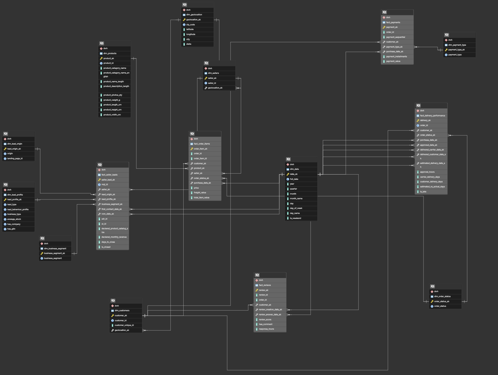

# Data Model

## Business Processes Identified

Five distinct business processes were identified in the Olist dataset, each represented as a fact table:

| Business Process | Fact Table | Grain |
|-----------------|------------|-------|
| Order line items (sales) | `fact_order_items` | One row per order item |
| Payment transactions | `fact_payments` | One row per payment installment per order |
| Delivery & logistics | `fact_delivery_performance` | One row per order |
| Customer reviews | `fact_reviews` | One row per review |
| Seller lead acquisition | `fact_seller_leads` | One row per marketing qualified lead (MQL) |
V
## Dimension Tables

| Dimension | Natural Key | Description |
|-----------|-------------|-------------|
| `dim_date` | `date_sk` (YYYYMMDD) | Calendar attributes: year, quarter, month, day, weekend flag |
| `dim_geolocation` | `zip_code` | Aggregated lat/lng per zip code, city, state |
| `dim_customers` | `customer_id` | Customer + their location (via geolocation_sk) |
| `dim_sellers` | `seller_id` | Seller + their location (via geolocation_sk) |
| `dim_products` | `product_id` | Product attributes + English category name |
| `dim_order_status` | `order_status` | Status codes: delivered, shipped, canceled, etc. |
| `dim_payment_type` | `payment_type` | Credit card, boleto, voucher, debit card |
| `dim_lead_origin` | `(origin, landing_page_id)` | How the lead was acquired |
| `dim_lead_profile` | Composite | Lead characteristics: type, behaviour, business type |
| `dim_business_segment` | `business_segment` | Industry segment of the seller lead |

## Data Model ERD

