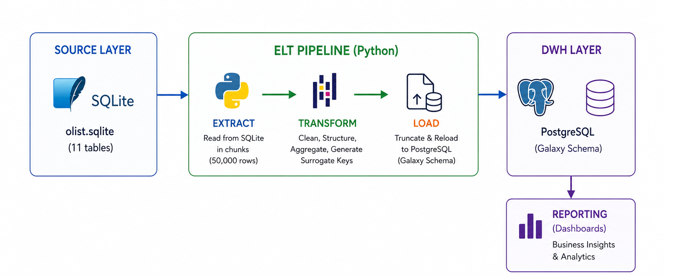

# ETL Pipeline Design

## Pipeline Overview

The pipeline follows a robust Extract, Transform, and Load (ETL) architecture, orchestrated entirely in Python. It is designed to be memory-efficient, idempotent, and highly reproducible.

## Execution Steps

**1. Extract Phase (Source to Staging)**
*   **Source:** A static SQLite database (`olist.sqlite`) containing raw operational data across 9 tables.
*   **Process:** Python connects to the SQLite database and reads the tables. To prevent out-of-memory errors on large tables (like the 1M+ row geolocation table), the data is extracted in **chunks of 50,000 rows** using Pandas.
*   **Destination:** The raw chunks are bulk-inserted directly into a `staging` schema within the target PostgreSQL database. The first chunk replaces the existing table, and subsequent chunks are appended.

**2. Transform Phase (Staging to DataFrames)**
*   **Process:** Data is read from the PostgreSQL `staging` tables back into Pandas DataFrames. 
*   **Cleaning & Structuring:** In this phase, the Python scripts enforce data types (explicit casting to Integer, Numeric, Boolean), handle missing values (e.g., filling unknown categories with `'unknown'`), and aggregate data (e.g., deduplicating geolocation data by zip code).
*   **Key Generation:** Meaningful Surrogate Keys are generated for the dimension tables (like converting date strings into `YYYYMMDD` integer keys for optimized querying).

**3. Load Phase (DataFrames to Data Warehouse)**
*   **Process:** The transformed data is pushed into the final **Kimball Galaxy Schema** located in the `dwh` schema of PostgreSQL.
*   **Load Strategy:** It uses a **Truncate-and-Reload** strategy. Before data is inserted, the existing target tables are completely truncated (including resetting identity sequences). 
*   **Execution Order:** The pipeline loads data hierarchically to respect Foreign Key constraints:
    1. Independent Dimensions (Date, Geolocation, Products)
    2. Dependent Dimensions (Customers, Sellers)
    3. Fact Tables (Sales, Payments, Delivery, Reviews, Leads)

## Diagram

