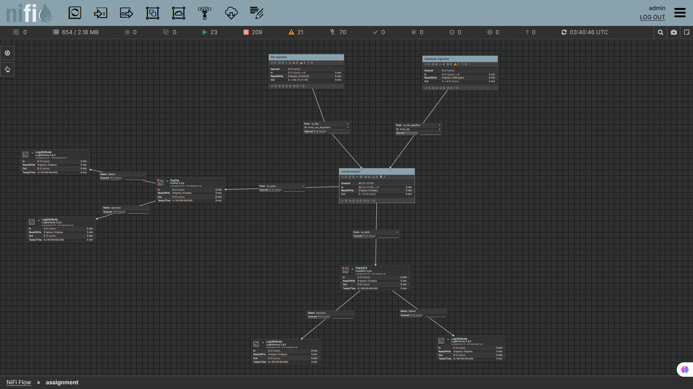
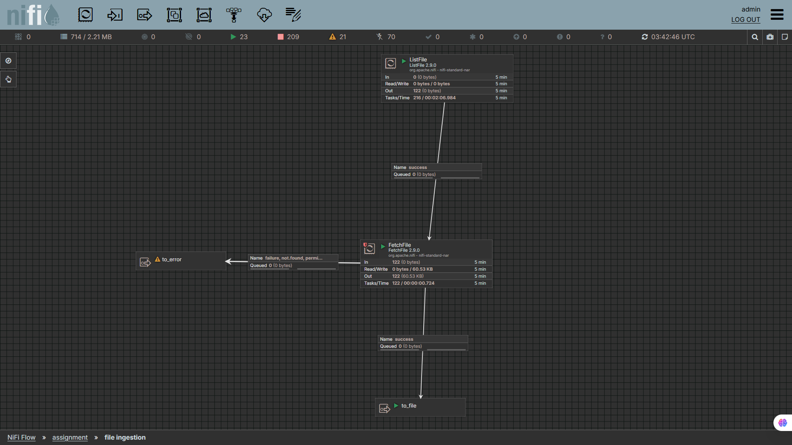
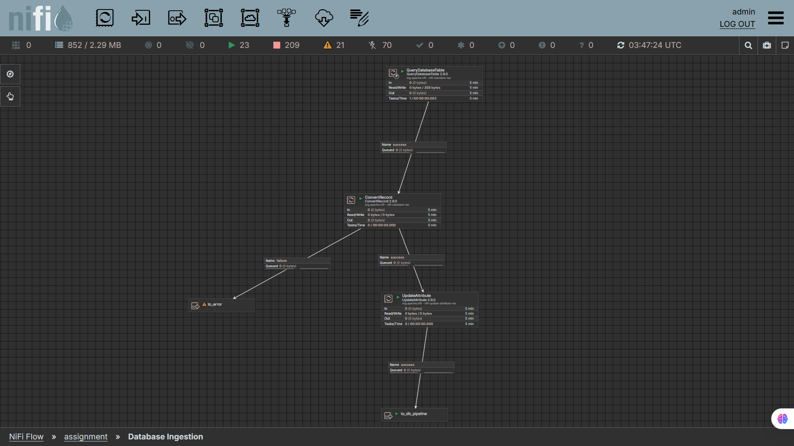
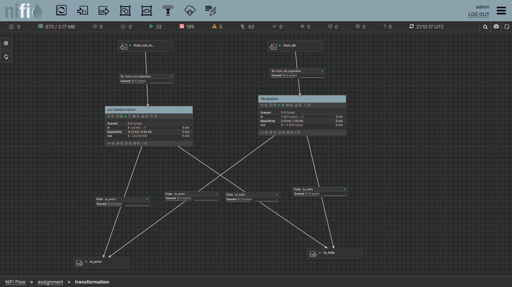

# Data Pipeline Project - NiFi Implementation

## Overview

This project implements an automated data processing pipeline using **Apache NiFi** (version 2.9.0). The pipeline ingests, transforms, and routes data from multiple sources to target storage systems, with robust error handling and data quality validation. It processes streaming CSV transactions and relational database records into a centralized Hadoop Distributed File System (HDFS).

## Architecture



The pipeline consists of three main processing groups:

1. **Database Ingestion** - Extracts customer data from PostgreSQL
2. **File Ingestion** - Reads CSV transaction files from local storage  
3. **Transformation & Validation** - Cleans, validates, and deduplicates data

```text
PostgreSQL ──┐
             ├──► Transformation ──► HDFS
CSV Files ───┘         │
                       ▼
               Error Files (Local)
```

## System Components & Implementation

### 1. File-Based Ingestion


**Explanation:** 
This section monitors the local directory for newly generated CSV files. It uses a `ListFile` processor to identify new files and a `FetchFile` processor to pull their contents into NiFi, ensuring no data loss and proper back-pressure before passing the data to the Transformation group.

### 2. Database Ingestion


**Explanation:** 
This section connects to the PostgreSQL database using a `DBCPConnectionPool` controller service. The `QueryDatabaseTable` processor extracts new rows incrementally and sends them into the Transformation group.

### 3. Transformation & Validation


**Explanation:** 
Inside this process group, data is converted, cleansed, and validated using Record-Oriented processors:
- **Cleanse (`UpdateRecord`):** Missing values like `customer_id` or `status` are replaced with safe default values (e.g., 'UNKNOWN').
- **Filter (`QueryRecord`):** SQL queries dynamically route invalid records (e.g., missing transaction IDs) to the error port.
- **Deduplicate (`DetectDuplicate`):** Ensures duplicate records generated by the source systems are removed using a Distributed Map Cache.

### 4. HDFS Storage & Error Routing


**Explanation:** 
Finally, valid, cleansed, and deduplicated records are sent out of the Transformation group and written directly into the Hadoop Distributed File System via the `PutHDFS` processor. Any failed or duplicated records are safely routed to local error directories.

## Sample Processed Data


**Explanation:** 
The final data is successfully stored in compressed Avro format in HDFS. It can be read and verified using PySpark, showing clean, structured rows completely free of duplicates and missing required values, ready for downstream analytics.
